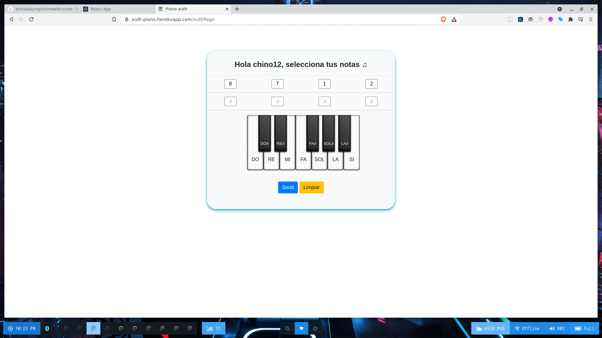

<h1 align="center">Welcome to Piano: Auth System 👋</h1>
<p>

  
  <a href="#" target="_blank">
    
  </a>
</p>

> Auth system using nodejs, express, handlebars and bootstrap

## Install

```sh
npm install
```

## Usage

```sh
npm run start
```

## Development

```sh
npm run dev
```

## Authors

- 👤 **Bryan Imbaquingo**
- 👤 **Kevin Changoluisa**

## Show your support

Give a ⭐️ if this project helped you!

---

_This README was generated with ❤️ by [readme-md-generator](https://github.com/kefranabg/readme-md-generator)_
